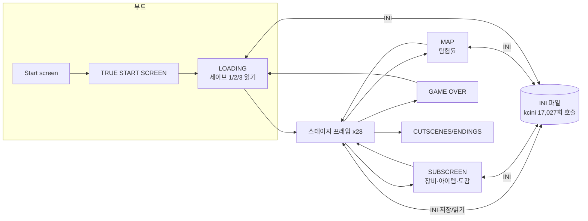

# CTLC2 구조 분석서

대상: `CTLC2upc.rar` 안의 *Castlevania: The Lecarde Chronicles 2* 실행 파일 2종 (`... 2 up.exe`, `... 2 upc.exe`)
목적: 이 게임이 **어떤 구조로 만들어졌는지** 뜯어보고, 그 구조를 **우리 게임으로 옮길 때 무엇을 살리고 무엇을 고칠지** 정한다.
작성: 2026-09-25. 수치는 모두 `up.exe`에서 직접 추출했다. 원시 데이터는 [`frames.json`](frames.json)에 있다.

> 이 문서는 **구조(설계 패턴)** 만 다룬다. 원본의 이미지·사운드·텍스트·캐릭터는 Konami IP와 팬게임 제작자의 저작물이므로 우리 저장소에 복사하지 않는다. 자세한 내용은 9장을 본다.

---

## 0. 한 장 요약

| 항목 | 값 |
|---|---|
| 엔진 | **Clickteam Fusion 2.5** (런타임 PAMU, 빌드 287), DirectX 9/8 렌더러 |
| 원본 프로젝트 파일 | `Lecarde chronicles II catoblepas 3.mfa` (exe에 경로가 남아 있음) |
| 해상도 / FPS | 640×480 창, 60 fps |
| 프레임(=씬) | **47개** (스테이지 28, 시스템 12, 보스러시 5, 컷신 1, 사운드 테스트 1) |
| 오브젝트 정의 | **4,812개** (Backdrop 2,795 · Active 1,664 · String 224 · Counter 89 · QuickBackdrop 29 · 확장 11) |
| 이미지 | 10,936장 (약 39 MB) |
| 사운드 | 668개, 풀면 약 150 MB (효과음 409 · 배경음 127 · 보이스 약 40) |
| 이벤트(=코드) | **129,813줄** (조건 293,854 · 액션 398,851) |
| 확장 | Platform Movement, Box2D(4종), kcini, kcdirect, Joystick2, XBOXGamepad, Ultimate Fullscreen |
| 셰이더 | `DualGlow.fx` 1개 |
| 언어 | 7개 (ENG, FR, ES, GER, ITA, JAP, BRA) |

핵심 구조를 한 문장으로 줄이면 이렇다.
**"모든 스테이지 프레임에 똑같은 2,560줄짜리 코어 이벤트 블록을 붙이고, 그 앞에 스테이지별 적·지형 이벤트를 두며, 프레임 사이의 상태는 전부 INI 파일로 주고받는다."**



---

## 1. 분석 방법

1. RAR에는 exe 2개와 `READ ME.txt`만 있다. 소스(.mfa)는 없다.
2. exe는 **PE 실행파일 + 뒤에 붙은 데이터(overlay)** 구조다. overlay는 오프셋 `0x60600`에서 시작한다.
3. overlay 앞부분은 `wwww` 팩 헤더로 시작하는 **런타임 파일 묶음**(30개)이고, 그 뒤가 `PAMU` 헤더로 시작하는 **게임 데이터 청크 스트림**이다.
4. 청크 형식은 `[id 2B][flags 2B][size 4B][data]`다. flags 0=평문, 1=zlib, 2=암호화, 3=암호화+zlib.
5. 이벤트·오브젝트 헤더·프레임 헤더·레이어·인스턴스 청크는 암호화(flags 3)되어 있다. Fusion 2.5 빌드 284 이상의 표준 방식(앱 이름 + 프로젝트 경로로 만든 키를 쓰는 RC4 계열 스트림)이다. 모든 청크가 같은 키 스트림을 쓰므로, 알려진 평문(압축 크기 필드 + zlib 헤더)으로 키 유도 방식을 검증했다.
6. 복호화한 이벤트를 `ER>> / ERes / ERev(여러 블록) / <<ER` 구조로 파싱해 이벤트 그룹 트리, 오브젝트 참조 빈도, 확장 호출 빈도, 문자열 파라미터를 뽑았다.

분석 스크립트는 저장소에 넣지 않았다(서드파티 보호 해제 코드이므로). 결과 데이터만 `frames.json`으로 남긴다.

**한계**: 조건/액션 번호를 사람이 읽는 이름으로 바꾸는 전체 매핑 표는 아직 없다. 그래서 "어떤 그룹이 무엇을 하는가"는 **그룹 이름(제작자가 단 프랑스어 주석) + 참조 오브젝트 + 문자열 파라미터**로 추정했다. 수치(데미지 공식 계수, 점프 높이 등)는 아직 뽑지 않았다.

---

## 2. 런타임 계층 (exe에 같이 들어 있는 파일)

| 파일 | 역할 | 우리 게임에서의 대응 |
|---|---|---|
| `stdrt.exe`, `mmfs2.dll` | Fusion 런타임 본체 | 브라우저 + 우리 게임 루프 |
| `mmf2d3d9.dll`, `mmf2d3d8.dll` | DirectX 9/8 렌더러 | Three.js / Canvas |
| `Platform.mfx` | **Platform Movement Object(PMO)**: 중력·점프·경사·천장 충돌을 처리하는 플랫포머 물리 | 직접 만든 캐릭터 컨트롤러 |
| `Box2DBase/Particules/RopeAndChain.mfx`, `Box2DStatic/BouncingBall.mvx` | Box2D 물리: 파편·파티클·밧줄/사슬·튕기는 공 | 연출용 파티클만 필요하면 자체 구현 |
| `pinball.mvx` | 핀볼 이동(튕김) | — |
| `kcini.mfx` | **INI 파일 읽기/쓰기**. 세이브 + 프레임 간 상태 전달 | 메모리 상태 저장소 + JSON 세이브 |
| `kcdirect.mfx` | 디렉터리/경로 조작 | — |
| `Joystick2.mfx`, `XBOXGamepad.mfx` | 게임패드 입력 | Gamepad API |
| `ultimatefullscreen.mfx` | 전체화면/스케일링 | CSS/캔버스 스케일 |
| `oggflt.sft`, `mp3flt.sft`, `waveflt.sft` | 오디오 디코더 | Web Audio |
| `cctrans.dll` | 화면 전환 효과(페이드 등) | 씬 전환 셰이더 |

확장별 이벤트 호출 횟수(전체 프레임 합):

| 확장 | 호출 | 의미 |
|---|---|---|
| kcini | **17,027** | 상태 관리 대부분이 파일 I/O를 거친다 |
| Platform Movement | 8,980 | 플레이어/일부 적 이동 |
| Box2D Rope & Chain | 4,380 | 밧줄·사슬·흔들리는 오브젝트 |
| XBOXGamepad | 1,242 | 패드 입력 |
| Box2D Particules | 791 | 파편/피 튀김 |
| kcdirect | 61 | 저장 경로 |
| Ultimate Fullscreen | 17 | 화면 모드 |

---

## 3. 씬(프레임) 구성

| 분류 | 프레임 | 역할 |
|---|---|---|
| 부트 | 0 Start screen, 9 MIGAMI, 10 TRUE START SCREEN | 로고 → 타이틀. TRUE START SCREEN이 실제 타이틀/파일 선택 |
| 로딩 | 8 LOADING, 41 Super load | 세이브 슬롯 1~3을 INI에서 읽어 전역 상태를 채운다 |
| 정리 | 2 Epuration, 42 epuration pour quelques stats de plus | "정화". 상태 초기화·통계 재계산용 중간 프레임으로 보인다 |
| 인증 | 4 cerificat passificat | 1줄짜리 통과 프레임 |
| 템플릿 | 1 reserve gfx | 인스턴스 0개. 코어 이벤트 그룹의 **빈 틀**과 그래픽 보관용 |
| 메뉴 | 5 SUBSCREEN, 7 MAP | 장비/아이템/도감, 지도/탐험률 |
| 실패 | 6 GAME OVER | |
| 연출 | 3 CUTSCENES/ENDINGS | 컷신과 엔딩을 한 프레임에 몰아 둠 |
| 스테이지 | 11~37, 44 | 28개 지역. 11(세이브 방)과 12(텔레포트 방)도 스테이지 코어를 가진다 |
| 보스러시 | 39, 40, 43, 45, 46 | 모드 선택(Alucard/Efrain) → 보스러시 → 결과 |
| 기타 | 38 Music xbox | 사운드 테스트 |

스테이지는 지역 단위로 크다(예: Servigny earldom 6400×5760px = 화면 10×12장). 즉 **"방 하나 = 프레임 하나"가 아니라 "지역 하나 = 프레임 하나"** 이고, 지역 안의 방 구분은 스크롤 경계와 문 오브젝트로 처리한다.

전체 표:

| # | 프레임 이름 | 분류 | 크기(px) | 레이어 | 인스턴스 | 이벤트 | 조건 | 액션 |
|---|---|---|---|---|---|---|---|---|
| 0 | Start screen | 시스템 | 640×480 | 1 | 5 | 371 | 392 | 483 |
| 1 | reserve gfx | 시스템 | 2000×2000 | 2 | 0 | 72 | 74 | 113 |
| 2 | Epuration | 시스템 | 640×480 | 1 | 3 | 295 | 548 | 434 |
| 3 | CUTSCENES/ENDINGS | 컷신/엔딩 | 3840×3000 | 9 | 96 | 707 | 1,237 | 1,521 |
| 4 | cerificat passificat | 시스템 | 640×480 | 1 | 4 | 84 | 96 | 141 |
| 5 | SUBSCREEN | 시스템 | 1920×1440 | 1 | 134 | 2,833 | 7,159 | 12,737 |
| 6 | GAME OVER | 시스템 | 640×480 | 1 | 29 | 567 | 804 | 712 |
| 7 | MAP | 시스템 | 640×2400 | 1 | 56 | 1,249 | 2,704 | 2,614 |
| 8 | LOADING | 시스템 | 640×480 | 1 | 20 | 621 | 1,240 | 9,453 |
| 9 | MIGAMI | 시스템 | 640×480 | 1 | 5 | 368 | 391 | 427 |
| 10 | TRUE START SCREEN | 시스템 | 1280×1440 | 1 | 50 | 904 | 1,806 | 1,463 |
| 11 | SAVE POINTS | 스테이지(세이브 방) | 5120×3360 | 7 | 671 | 3,216 | 6,998 | 17,182 |
| 12 | TELEPORT POINTS | 스테이지(텔레포트 방) | 5120×2880 | 7 | 328 | 2,924 | 6,441 | 7,801 |
| 13 | opening Rome | 스테이지 | 5120×2880 | 7 | 761 | 3,495 | 8,009 | 10,453 |
| 14 | villages et villes | 스테이지 | 5120×3840 | 7 | 1184 | 3,850 | 9,408 | 13,133 |
| 15 | Servigny earldom | 스테이지 | 6400×5760 | 7 | 2028 | 3,871 | 8,836 | 11,902 |
| 16 | Auberge/dark forest | 스테이지 | 7680×4800 | 7 | 1790 | 3,703 | 8,433 | 11,291 |
| 17 | Gondre mine | 스테이지 | 4480×6720 | 7 | 1799 | 3,618 | 8,223 | 10,645 |
| 18 | Servigny mansion | 스테이지 | 6400×4320 | 7 | 1604 | 3,778 | 8,666 | 11,307 |
| 19 | La Tourvelle earldom | 스테이지 | 6400×5760 | 7 | 1993 | 4,242 | 9,871 | 13,399 |
| 20 | ice cave | 스테이지 | 6400×4320 | 7 | 2323 | 3,613 | 8,130 | 10,768 |
| 21 | Sautelle cemetery | 스테이지 | 8960×2880 | 7 | 1719 | 3,683 | 8,347 | 10,897 |
| 22 | La Tourvelle castle | 스테이지 | 4480×4800 | 7 | 1512 | 3,719 | 8,490 | 10,998 |
| 23 | Albaret Earldom | 스테이지 | 5760×6240 | 7 | 2915 | 4,126 | 9,450 | 13,035 |
| 24 | St Justine Convent | 스테이지 | 7040×2400 | 7 | 1687 | 3,688 | 8,451 | 11,170 |
| 25 | Guernon University | 스테이지 | 6400×2400 | 7 | 1261 | 3,835 | 8,840 | 11,666 |
| 26 | Entrance Main Hall | 스테이지 | 9600×3360 | 7 | 1614 | 3,580 | 8,097 | 10,395 |
| 27 | Castle Clockwork | 스테이지 | 5120×4800 | 7 | 1406 | 3,609 | 8,237 | 10,455 |
| 28 | Ancient Library | 스테이지 | 4480×4320 | 7 | 1061 | 3,528 | 8,151 | 10,649 |
| 29 | Horror Gallery | 스테이지 | 7680×2880 | 7 | 1546 | 3,787 | 8,596 | 11,013 |
| 30 | 4 Seasons Hall | 스테이지 | 5120×4800 | 7 | 1606 | 3,858 | 8,800 | 11,756 |
| 31 | Underground Caves | 스테이지 | 6400×5760 | 7 | 2785 | 3,948 | 8,886 | 12,019 |
| 32 | Garden | 스테이지 | 8960×4320 | 7 | 1446 | 3,947 | 8,988 | 11,844 |
| 33 | Garden of deads | 스테이지 | 7040×5280 | 7 | 2548 | 4,184 | 9,612 | 12,879 |
| 34 | Underground aqueduct | 스테이지 | 7680×2880 | 7 | 1400 | 3,373 | 7,674 | 9,649 |
| 35 | Illusion Chamber | 스테이지 | 5760×3360 | 7 | 1227 | 3,627 | 8,182 | 10,492 |
| 36 | Princely rooms | 스테이지 | 8320×4320 | 7 | 2025 | 4,258 | 9,627 | 12,949 |
| 37 | Altar | 스테이지 | 8960×2880 | 7 | 1224 | 3,975 | 9,178 | 11,672 |
| 38 | Music xbox | 사운드 테스트 | 640×480 | 1 | 15 | 571 | 858 | 667 |
| 39 | Boss rush normal | 보스러시 | 7680×4320 | 7 | 1873 | 5,650 | 13,241 | 18,171 |
| 40 | Boss rush results | 보스러시 | 640×480 | 1 | 18 | 709 | 1,216 | 894 |
| 41 | Super load | 시스템 | 640×480 | 1 | 35 | 663 | 1,080 | 799 |
| 42 | epuration pour quelques stats de plus | 시스템 | 640×480 | 1 | 20 | 1,877 | 5,024 | 5,856 |
| 43 | Boss rush Alucard | 보스러시 | 7680×4320 | 7 | 1872 | 6,969 | 16,539 | 21,185 |
| 44 | Purifiée de toute infection | 스테이지 | 5120×2880 | 7 | 176 | 3,030 | 6,874 | 8,257 |
| 45 | Choix ALUCARD EFRAIN | 보스러시 | 640×480 | 1 | 10 | 530 | 736 | 613 |
| 46 | Boss rush results Alucard | 보스러시 | 640×480 | 1 | 18 | 708 | 1,214 | 892 |

---

## 4. 이벤트(코드) 구조

### 4.1 모든 프레임에 붙는 "코어 블록"

47개 프레임 **전부**가 같은 이름·같은 순서의 그룹 27개를 가진다. 스테이지 프레임 28개에서는 그룹별 이벤트 수까지 **완전히 같다**(아래 표의 숫자가 28개 프레임에서 한 자리도 다르지 않다). 메뉴·부트 프레임에서는 같은 틀에 필요한 부분만 채워져 있다. `reserve gfx` 프레임이 이 틀의 템플릿이다. 예외는 `Boss rush Alucard`로, 알루카드용 이동·검·필살기 그룹이 한 벌 더 붙어 코어가 두 배 가까이 된다.

즉, 제작자는 Fusion 2.5의 "다른 프레임 이벤트 포함" 기능 또는 복사-붙여넣기로 **플레이어·전투·UI·사운드 엔진 전체를 프레임마다 복제**했다. 스테이지 한 곳당 약 2,560줄, 28곳이면 약 7만 줄이 같은 코드의 사본이다.

코어 블록 트리(스테이지 기준, 숫자=이벤트 수):

| 그룹(원문) | 뜻 | 이벤트 | 하는 일(추정 근거: 참조 오브젝트·문자열) |
|---|---|---|---|
| desactivation de groupes | 그룹 비활성화 | 4 | 프레임 시작 시 쓰지 않는 그룹 끄기 |
| **CONTROLS** › CONTROL CENTRAL SYSTEM JOYPAD/KEYBOARD | 입력 중앙 처리 | 150 | 키보드·패드 입력을 가상 컨트롤러 오브젝트(`A.main true controller`) 값으로 통일 |
| **SOUND SYSTEM** › SOUND EFFECTS | 효과음 | 283 | `A.main SOUND calculator`에 값이 들어오면 해당 효과음 재생. 효과음 호출이 한 곳에 모여 있다 |
| SOUND SYSTEM › MUSICS | 배경음 | 9 | 지역별 BGM 전환 |
| **Principal ACTION ONLY** › Debut de stage destructions | 스테이지 시작 시 파괴 | 1 | |
| › SCROLLIND/POSITION | 스크롤·위치 | 73 | `A.scrolling regulator`로 카메라 추적·경계 제한 |
| › retouches originales | 원본 보정 | 8 | |
| › plateformes … mobiles et escaliers ainsi que fleches | 이동 발판·계단·화살표 | 46 | 움직이는 발판, 계단 타기 |
| › **Mouvements** | 이동 | 264 | PMO + `A.main delacement principal`(보이지 않는 이동 판정체). 애니메이션 상태 `Arrêté/Marche/Course`(정지/걷기/달리기), `Grimpe`(오르기), `Rebond`(튕김) |
| › swords | 검(주무기) | 99 | `A.main weapon slash`, `A.main arme principale` |
| › **FURIES** | 필살기 | 255 | 필살기 게이지·레벨(`A.interface fury level indicator`) |
| › armes secondaires | 보조무기 | 100 | 도끼·부메랑·단검·수정·성수(`A.subweapon *`) |
| › TEXT SYSTEM / Apparition total fric / TITRE | 텍스트·돈 표시·지역명 | 162 | |
| › impacts normaux et spéciaux | 타격 판정 | 145 | `A.main impacts inst creator`, `continu creator`: 타격 이펙트와 판정을 만드는 생성기 |
| › global candeloro et mur destroyable | 촛불·부서지는 벽 | 109 | Castlevania식 촛불 파괴 → 아이템 드롭 |
| › création de chiffres | 숫자 생성 | 58 | 데미지 숫자 팝업(`A.chiffres creator`) |
| › comptabilité générale / interface / time / passage eau fire | 전체 수치·UI·시간·물/불 통과 | 134 | HUD, 물·용암 지형 효과 |
| › calcul attac / perte de vie / DEF / coeurs / bad status / equipement | 공격·피해·방어·하트·상태이상·장비 계산 | 98 | **데미지 공식**과 상태이상(저주·독·기절·약화·봉인) |
| › TEMPS/JOUR NUIT | 시간·낮밤 | 50 | 게임 내 시계(`sec/min/hou`)와 낮밤 전환 |
| › A METTRE A LA FIN DES ACTIONS | 액션 끝에 둘 것 | 10 | 프레임 마지막 정리(실행 순서 의존 코드) |
| **Calculs en tous genres OBJETS** › display options | 표시 옵션 | 14 | |
| › Mega comptabilité valeurs armes et autres equipements et timer | 무기·장비 수치 총계 | 76 | 장비 스탯 합산 |
| › Tous items ramassés et vendus | 줍고 판 아이템 전부 | 409 | 아이템별로 획득·판매 처리를 한 줄씩 나열 |

### 4.2 스테이지별 블록

코어 블록 앞에 스테이지 전용 블록이 온다. 모든 스테이지가 같은 뼈대를 쓴다.

| 그룹 | 이벤트(Servigny earldom 기준) | 하는 일 |
|---|---|---|
| provisoire | 16 | 임시/디버그 |
| **Qualifiers system** | 50 | Fusion의 한정자(qualifier)로 "모든 적", "모든 발판" 같은 묶음을 한 번에 처리 |
| SELON STAGE › Debut du stage imperatif | 11 | 스테이지 진입 필수 초기화 |
| › general/scrollind | 201 | 이 지역의 스크롤 경계·방 구분 |
| › murs destroyables | 2 | 부서지는 벽 |
| › TEXTES MAIN | 64 | 지역 대사·표지판 |
| › Stage sounds | 15 | 지역 효과음 |
| › Temps, sons d'ambiance, JOUR NUIT | 21 | 환경음·낮밤 |
| › **ENEMIES** › (적 이름별 그룹) | 적 1종당 44~130 | 적마다 그룹 하나. 예: Lost Head 58, Skeleton 70, Bat 54, Troll 63 |
| › Candles / objets textes prise d'objet | 62 | 촛불·아이템 획득 문구 |
| › pieges sortie de monstres | 128 | 함정·적 출현 트리거 |

보스 그룹은 이벤트가 더 많다(보스러시 기준 Efrain fake 133, Nightmare Plant 129, Constance d'Albaret 123, Maximilien de Servigny 118, Illusionist 117). 그룹 이름에 **약점·필요 조건을 메모**해 둔 것도 보인다. 예: `Hanged  X eau ben div sacr`(성수·신성 무기로 처치), `Nightmare Plant … a besoin de X subweapons`(보조무기 필요), `DEATH needs slogras et Balkans`(동반 적 필요).

### 4.3 메뉴 프레임

- **SUBSCREEN (2,833줄)**: `PAGE D'ACCUEIL`(첫 페이지) · `ITEMS EQUIPEMENTS` › `items`·`Equipements` › `EPEES/ARMORS/Head gears/RINGS/NECKLACES`(각 100줄) · `RELICS KNIGHT`(209) · `GUIDE`(43) · **`DIE MONSTER`(642줄, 몬스터 도감)**. 장비 카테고리마다 정확히 100줄씩인 것은 슬롯을 **한 줄씩 하드코딩**했다는 뜻이다.
- **MAP (1,249줄)**: 지역 그룹 `ROME / SERVIGNY EARLDOM / LA TOURVELLE EARLDOM / ALBARET EARLDOM / CASTLE OF ETERNAL NIGHT` + `Calculateur de pourcentage`(탐험률). 지역마다 `A.main variables MAP <지역>` 오브젝트가 있고, 그 alterable value에 방 방문 여부를 저장한다.
- **LOADING (621줄, 액션 9,453개)**: `MAIN LOADING SYSTEM SAVE 1/2/3`이 각각 70줄로 **슬롯마다 똑같이 복제**되어 있다. INI 섹션 `lcfbotoxmap`, `lcfbotoxvar`, `servignymap`, `tourvellemap`, `albaretmap`, `monsters`, `varequip`과 숫자 키(`100`~`123`…)를 읽는다. 세이브 파일 이름은 `fichierS`, `fichierS2`, `fichierS3`이다.

### 4.4 오브젝트 명명 규칙

제작자는 접두어로 역할을 구분했다. 이 규칙은 우리도 그대로 가져갈 가치가 있다.

| 접두어 | 수 | 의미 | 예 |
|---|---|---|---|
| `A.` | 74 | **시스템 오브젝트**(보이지 않는 계산기·생성기·상태 보관함) | `A.main SOUND calculator`, `A.main heros collidor`, `A.Var equipements`, `A.ini.subsclc2` |
| `E-`, `E.` | 569 | 적과 그 부속물 | `E-skeleton`, `E-skeleton debris`, `E-skeleton os`(뼈 투사체) |
| `S.` | 수백 | 스테이지 장치(촛불·문·조각상·바퀴 등) | `S. candeloro`, `S.porte de la CRS` |
| `B.`, `B.D.`, `C.` | 약 2,800 | 배경(Backdrop). 지역별 타일 | `B.D.ice…`, `B.D.mine…` |
| `A.interface …` | — | HUD/텍스트 | `A.interface main texte ENG/FR/ES/GER/ITA/JAP/BRA` |

적 하나는 **본체 + 변형 오브젝트 여러 개**로 이루어진다: `tir`(투사체), `debris`/`restes`(잔해·사체), `os`(뼈), `mortem`(사망 연출), `sang gicle`(피 튐), `apparait`(등장). 적 관련 오브젝트는 569개이고, 본체만 세면 대략 150종이다.

이벤트에서 가장 많이 참조되는 오브젝트(= 사실상의 전역 변수·서비스):

| 오브젝트 | 참조 | 역할 |
|---|---|---|
| A.ini.subsclc2 | 16,755 | INI 핸들. 세이브/로드와 프레임 간 상태 |
| A.main delacement principal | 8,932 | 플레이어 이동체 |
| A.interface main texte cadré | 7,890 | 대사창 |
| A.main SOUND calculator | 7,879 | 사운드 요청 큐 |
| A.main impacts inst creator | 7,121 | 타격 판정 생성기 |
| A.main heros collidor | 5,068 | 플레이어 피격 판정 |
| A.main Boss/position scene calculator | 4,348 | 보스전 카메라·위치 |
| A.main pas glob creator monster | 4,330 | 적 스폰 |
| A.scrolling regulator | 3,221 | 카메라 |
| A.auject | 3,133 | 아이템(오브젝트) 드롭 |

### 4.5 화면 레이어

스테이지 프레임은 레이어 7개를 쓰며, 스크롤 계수가 `0 / 0.2 / 0.5 / 0.75 / 1 / 1 / 1`이다. 뒤쪽 4장은 **패럴랙스 배경**, 앞쪽 3장은 게임플레이·전경이다.

### 4.6 에셋

- **이미지 10,936장**: 한 애니메이션 프레임이 이미지 한 장이다. 배경은 타일맵이 아니라 Backdrop 오브젝트 2,795개를 직접 배치했다.
- **사운드 668개(풀면 약 150 MB)**: 이름 접두어로 분류된다. `fx…` 409(효과음), `Y-…` 127(배경음), `en <캐릭터> <대사>` 약 40(보스 보이스), 그 밖에 `F…`, `X…`, `Z…` 계열. 배포 파일이 195 MB나 되는 주된 원인이 사운드다.
- **셰이더**: `DualGlow.fx` 1개(발광).

---

## 5. 설계 패턴 평가: 살릴 것과 고칠 것

### 5.1 살릴 것 (잘 된 설계)

1. **입력 추상화**: 키보드·패드를 `CONTROL CENTRAL SYSTEM` 한 곳에서 가상 컨트롤러 값으로 바꾸고, 게임 로직은 그 값만 본다.
2. **사운드 버스**: 효과음 재생을 `SOUND calculator` 하나로 모았다. 게임 로직은 "무슨 소리"만 요청한다.
3. **생성기(Factory) 오브젝트**: 타격 판정·이펙트·숫자 팝업·적 스폰을 전용 생성기에서 만든다.
4. **판정체와 그림의 분리**: 보이지 않는 이동체/충돌체(`delacement principal`, `heros collidor`)가 물리를 맡고 스프라이트는 따라간다.
5. **한정자(qualifier) 그룹**: "모든 적" 같은 묶음에 규칙을 한 번에 건다. 우리 코드에서는 태그/컴포넌트 쿼리에 해당한다.
6. **적 = 그룹 하나**: 적 하나의 로직이 그룹 하나에 모여 있어 찾기 쉽다.
7. **명명 접두어**: `A.`/`E-`/`S.`/`B.` 규칙 덕분에 4,812개 오브젝트가 그나마 관리된다.
8. **패럴랙스 레이어 규약**: 모든 스테이지가 같은 7레이어 계수를 쓴다.

### 5.2 고칠 것 (구조적 부채)

| # | 문제 | 근거 | 영향 |
|---|---|---|---|
| D1 | **코어 로직 28벌 복제** | 스테이지 28곳의 코어 그룹 이벤트 수가 전부 같음(프레임당 약 2,560줄) | 버그 하나를 28곳에서 고쳐야 한다. 누락되면 지역마다 동작이 달라진다 |
| D2 | **INI 파일을 전역 상태 저장소로 사용** | kcini 호출 17,027회 | 느리고 깨지기 쉽다. `READ ME.txt`에 적힌 "MAP이나 SUBSCREEN에 들어갈 때 튕기면 데이터를 못 쓰는 것이니 게임 폴더를 옮겨라"가 바로 이 구조에서 나온다 |
| D3 | **세이브 슬롯별 코드 복제** | LOADING의 SAVE 1/2/3 그룹이 각 70줄로 동일 | 슬롯·필드를 추가할 때마다 3번 수정 |
| D4 | **매직 넘버 키** | INI 키 `100`, `101` … `123` | 무슨 값인지 코드만 봐서는 알 수 없다 |
| D5 | **데이터가 코드에 박혀 있음** | 장비 카테고리마다 정확히 100줄, 아이템 획득/판매 409줄, 도감 642줄 | 아이템 하나 추가 = 이벤트 여러 줄 추가 |
| D6 | **적 AI 공통 부품 없음** | 적마다 44~130줄을 따로 작성 | 순찰·추격·피격·사망 같은 공통 동작을 적마다 다시 구현 |
| D7 | **언어별 텍스트 오브젝트 7개** | `A.interface main texte ENG/FR/…` 각 1,089회 참조 | 문구 하나 고칠 때 7곳 수정 |
| D8 | **실행 순서 의존** | `A METTRE A LA FIN DES ACTIONS`(액션 끝에 둘 것) 그룹 | 그룹 순서를 바꾸면 동작이 바뀐다 |
| D9 | **배경을 개별 오브젝트로 배치** | Backdrop 2,795개, 스테이지당 인스턴스 1,000~2,900개 | 레벨 편집·로딩이 무겁다. 타일맵이 없다 |
| D10 | **에셋 용량** | 사운드만 약 150 MB | 배포·로딩 부담 |

---

## 6. 우리 게임으로 옮길 때의 목표 구조

우리 저장소는 이미 **Vite + TypeScript + Three.js + Web Audio + vitest**, `src/{core,gen,entities,systems,audio,render}` 구조다. CTLC2의 "서비스 오브젝트" 패턴은 살리고, 5.2의 부채는 처음부터 피하도록 다음과 같이 대응시킨다.

### 6.1 대응표

| CTLC2 구성 요소 | 우리 구조(제안) | 해소하는 부채 |
|---|---|---|
| 코어 블록 28벌 복제 | `src/game/loop.ts` 하나에서 모든 씬이 공유하는 시스템을 정해진 순서로 실행 | D1, D8 |
| 프레임 = 지역 | `src/scenes/*` (boot, title, loading, stage, subscreen, map, gameover, ending). 스테이지 씬은 **하나**이고 지역 데이터만 바꿔 끼운다 | D1 |
| `A.ini.subsclc2` + INI | `src/core/state.ts`(메모리 상태 스토어) + `src/core/save.ts`(JSON 직렬화, 스키마 버전) | D2, D3, D4 |
| `CONTROL CENTRAL SYSTEM` + `A.main true controller` | `src/input/actions.ts`: 키/패드 → 액션 이름 매핑 | 계승 |
| `A.main SOUND calculator` | `src/audio/bus.ts`: `play("hoof.gallop")` 형태의 이벤트 버스 | 계승 |
| `A.main delacement principal` + PMO | `src/entities/player.ts` 상태기계 + 순수 함수 물리(지금 `unicorn.ts`가 이 역할) | 계승 |
| `A.main heros collidor`, `impacts creator` | `src/systems/combat.ts`: 히트박스/허트박스, 데미지 공식은 순수 함수 | 테스트 가능 |
| `calcul attac / … bad status` | `src/systems/damage.ts`, `src/systems/status.ts` + `data/status.json` | D5 |
| 적 그룹(적 1종당 1그룹) | `src/entities/enemy/` 공통 FSM(순찰·감지·추격·공격·피격·사망) + `data/enemies.json` 파라미터 | D6 |
| `E-x tir/debris/os` 변형 오브젝트 | 적 정의 안의 `projectiles`, `remains` 필드 | D6 |
| 아이템 409줄·장비 100줄·도감 642줄 | `data/items.json`, `data/equipment.json`, `data/bestiary.json`. UI는 데이터로 목록 생성 | D5 |
| 언어별 텍스트 오브젝트 7개 | `src/i18n/{ko,en}.json` + `t("key")` | D7 |
| MAP + 탐험률 계산기 | `src/systems/exploration.ts`(방 방문 비트셋) | D4 |
| 세이브 방/텔레포트 방 | 지역 데이터 안의 `checkpoint`/`warp` 노드 | D1 |
| 7레이어 패럴랙스 | 렌더 레이어 규약(2D면 계수 표 그대로, 3D면 원경 레이어) | 계승 |
| Backdrop 2,795개 | 타일맵 또는 프로시저럴 생성(`src/gen`) | D9 |
| 150 MB 사운드 | 절차적 합성(현재 방식) 또는 OGG 압축 | D10 |

### 6.2 권장 폴더

```
src/
  core/        rng, state(store), save(JSON+version), time(day/night)
  input/       actions (keyboard + gamepad)
  audio/       bus, synth, music
  entities/    player, enemy/(base FSM + behaviors), npc
  systems/     combat, damage, status, drops, exploration, noise
  scenes/      boot, title, loading, stage, subscreen, map, gameover, ending
  ui/          hud, dialog, menu
  i18n/        ko.json, en.json
data/          enemies.json, items.json, equipment.json, bestiary.json, regions.json
tests/         순수 로직 단위 테스트 (damage, status, save 왕복, enemy FSM, exploration)
```

### 6.3 옮기는 순서

1. **상태·세이브 먼저**: `state` + `save`(JSON, 스키마 버전, 슬롯 N개를 코드 하나로). CTLC2가 가장 크게 망가진 곳(D2·D3·D4)이라 처음부터 막는다.
2. **공유 게임 루프**: 입력 → 플레이어 → 적 → 전투 → 사운드 버스 → UI 순서를 한 곳에 고정한다(D1·D8).
3. **데이터 주도 적**: 공통 FSM 1개 + `enemies.json`. 적 3종으로 시작해 패턴을 검증한다(D6).
4. **아이템·장비·도감 데이터화**(D5).
5. **서브스크린/맵 씬**: 데이터에서 목록을 그린다.
6. **지역 확장**: 스테이지 씬 하나 + 지역 데이터 추가만으로 늘린다.

---

## 7. 우리 게임(「캔디마운틴까지」)과의 연결점

현재 GDD 요소 가운데 CTLC2 구조와 바로 맞물리는 부분이다. **목표 게임을 이 방향으로 확정할지는 아직 열린 질문이다**(`plan/ctlc2/tasks.md` Q1).

| 캔디마운틴까지 | CTLC2 대응 구조 |
|---|---|
| HP 3단계(꼬리·갈기·통째로) | `calcul … perte de vie` → `systems/damage.ts` |
| 소음 규칙 → 처녀 추격 | 적 감지 FSM의 "청각 감지" behavior |
| 처녀·마녀 | `enemies.json`의 두 정의(속도·감지 반경·공격) |
| 뿔·입·발굽 아이템 | `armes secondaires`(보조무기) 패턴 → 액션 슬롯 |
| 약초 3종 | 아이템 + 엔딩 플래그 |
| 털보 오두막 체크포인트 | `SAVE POINTS` 프레임 → 지역 데이터의 `checkpoint` 노드 |
| 엔딩 5분기 | `CUTSCENES/ENDINGS` 한 프레임 → `scenes/ending.ts` + 분기 표 |
| 낮밤·앰비언스 | `TEMPS/JOUR NUIT` → `core/time.ts` |

---

## 8. 추가로 확인하면 좋은 것

- 조건/액션 번호 → 이름 매핑 표를 붙여 **데미지 공식·점프 수치**를 실제 값으로 뽑기
- `upc.exe`(대체 영상 모드판)와 `up.exe`의 차이(파일 크기 650바이트 차)
- 스테이지 안의 방 구분(스크롤 경계 이벤트 201줄) 규칙 정리 → 우리 방/지역 데이터 형식 설계의 입력
- 보스 그룹 하나를 골라 상태 전이 전체를 문서화 → 보스 FSM 템플릿

## 9. 법적·윤리적 경계

- CTLC2는 Konami의 *Castlevania* IP를 쓴 무료 팬게임이다. 이미지·사운드·음악·대사·캐릭터·지명은 **가져오지 않는다**.
- 이 문서는 구조(시스템 분할, 데이터 흐름, 명명 규칙, 규모 지표)만 기록한다. 우리 구현은 전부 새로 작성한다.
- 추출한 에셋, 복호화한 원본 데이터, 복호화 스크립트는 저장소에 커밋하지 않는다.
