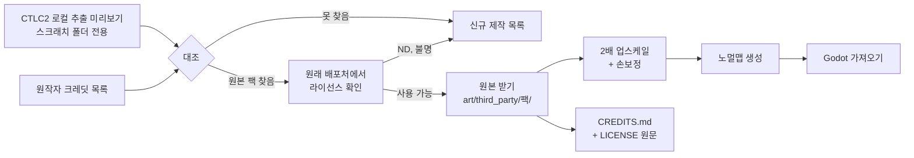

# 에셋 출처·라이선스 정책 (HD 리마스터용)

작성: 2026-09-25 · 적용 대상: Godot 신작의 `art/`, `audio/` 전체

## 1. 원칙

1. CTLC2 원작자가 오픈소스 에셋을 가져다 쓴 부분이 있다. **그 에셋은 원래 라이선스 범위에서** 업스케일해 쓸 수 있다.
2. **파일은 반드시 원래 배포처에서 받는다.** CTLC2 실행 파일에서 뽑은 이미지는 출처를 대조하는 용도로만 쓰고, 저장소에 넣지 않는다.
   - 이유: CTLC2 이미지에는 오픈소스 에셋, Konami 원작에서 가져온 스프라이트, 원작자가 직접 그린 그림이 섞여 있다. 뽑은 파일만 보고는 어느 쪽인지 알 수 없고, 원작자가 수정한 부분은 원작자의 저작물이다.
3. 출처와 라이선스를 확인하지 못한 에셋은 **신규 제작 목록**으로 보낸다.
4. 배포 형태: **무료 배포**. NC(비영리) 라이선스도 쓸 수 있지만, 나중에 유료로 바꾸면 NC 에셋은 모두 교체해야 한다.

## 2. 라이선스 판정표

| 라이선스 | 업스케일·수정 | 무료 배포 | 의무 |
|---|---|---|---|
| CC0 / Public Domain | 가능 | 가능 | 없음 (표기 권장) |
| CC-BY 3.0/4.0, OGA-BY | 가능 | 가능 | 작가·라이선스·원본 링크·**수정 사실** 표기 |
| CC-BY-SA 3.0/4.0 | 가능 | 가능 | 위 표기 + **업스케일본도 CC-BY-SA로 공개** |
| GPL 2/3 (아트) | 가능 | 가능 | 위 표기 + 수정본 소스(원본 파일) 공개. 게임 전체에 미치는 범위는 해석이 갈리므로 **가능하면 다른 에셋 우선** |
| CC-BY-NC(-SA) | 가능 | 가능 | 표기(+SA 의무). **판매 불가** |
| ND(변경 금지) 포함 | **불가** | — | 업스케일 자체가 변경이다 |
| 라이선스 불명 / 무단 립(rip) | **불가** | — | 신규 제작 |
| Konami 등 상업 게임 유래 | **불가** | — | 신규 제작 |

이름·설정도 같은 원칙이다. "Castlevania", "Alucard", "Belmont" 같은 명칭과 CTLC2 고유 캐릭터·지명은 쓰지 않는다.

## 3. 진행 절차

## 4. 출처 조사표 형식

`asset_audit/inventory.csv`(로컬)와 저장소의 `docs/assets/provenance.csv`(신작 저장소)는 같은 열을 쓴다.

| 열 | 내용 |
|---|---|
| kind | sprite / backdrop / effect / tile |
| object | CTLC2 오브젝트 이름 (대조용) |
| animations, frames, size | 규모 |
| preview | 로컬 미리보기 경로 |
| source_url | 원래 배포처 URL |
| author | 작가 |
| license | 정확한 라이선스와 버전 |
| usable | yes / no / remake |
| notes | 수정 범위, SA 여부 등 |

## 5. 로컬 추출 현황 (2026-09-25)

- 위치: 작업 PC 스크래치 폴더의 `asset_audit/` (저장소에 넣지 않음)
- 스프라이트 오브젝트 1,292개: 오브젝트마다 애니메이션별 앞 8프레임을 한 장의 시트로 묶음
- 배경(Backdrop) 2,471개: 한 장씩 PNG로 저장
- 이미지 형식: 24비트 7,597장 + 알파 채널 8장 (전부 해석 성공)
- 대조 우선순위: 배경·타일(수가 많고 오픈소스 비중이 클 가능성) → 이펙트 → 일반 적 → 보스 → 플레이어

## 6. 저장소 규칙

- `art/third_party/<팩 이름>/` 안에 `original/`(받은 원본), `upscaled/`(수정본), `LICENSE`(원문)를 둔다.
- `CREDITS.md`는 팩 단위로 작가, 라이선스, 원본 URL, 수정 내용을 적는다. 게임 안의 크레딧 화면도 이 파일에서 만든다.
- CI의 라이선스 게이트: `CREDITS.md`에 등록되지 않은 파일이 `art/`, `audio/`에 있으면 실패한다.
