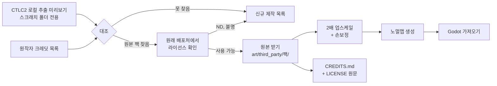

# 에셋 출처·라이선스 정책 (HD 리마스터용)

작성: 2026-09-25 · 적용 대상: Godot 신작의 `art/`, `audio/` 전체

## 0. 권리 관계 (2026-09-25 사용자 확인)

- 사용자 확인: **Konami와 CTLC2 원작자가 무료 배포 팬게임에서는 사용해도 된다고 허락했다.** 이 프로젝트(가칭 Anankad)도 무료 배포 팬게임이다.
- 이 허락은 **무료 팬게임**이라는 조건에 묶여 있다. 유료 판매, 후원 보상용 판매, 광고 수익화로 바꾸면 효력이 없다고 보고 다시 확인한다.
- 허락의 근거(원작자 메시지, 공지 링크, 캡처)를 `docs/permissions/`에 보관한다. 근거 파일은 아직 받지 못했다.
- 오픈소스 에셋은 이 허락과 별개로 **각 라이선스 조건**(표기, SA, ND)을 계속 지킨다.

## 1. 원칙

1. CTLC2 원작자가 오픈소스 에셋을 가져다 쓴 부분이 있다. **그 에셋은 원래 라이선스 범위에서** 업스케일해 쓸 수 있다.
2. **오픈소스 에셋은 원래 배포처에서 받는다.** 라이선스 원문과 작가 표기를 함께 가져오기 위해서다. Konami 유래·원작자 제작 그림은 허락 범위에서 CTLC2 추출본을 업스케일 원본으로 써도 된다.
   - 어느 그림이 어느 출처인지는 `inventory.csv`로 가려 두어야 크레딧과 라이선스 의무를 정확히 지킬 수 있다.
3. 출처를 확인하지 못한 에셋은 원작자에게 묻고, 확인 전까지는 보류한다.
4. 배포 형태: **무료 배포**. NC(비영리) 라이선스도 쓸 수 있지만, 나중에 유료로 바꾸면 NC 에셋은 모두 교체해야 한다.

## 2. 라이선스 판정표

| 라이선스 | 업스케일·수정 | 무료 배포 | 의무 |
|---|---|---|---|
| CC0 / Public Domain | 가능 | 가능 | 없음 (표기 권장) |
| CC-BY 3.0/4.0, OGA-BY | 가능 | 가능 | 작가·라이선스·원본 링크·**수정 사실** 표기 |
| CC-BY-SA 3.0/4.0 | 가능 | 가능 | 위 표기 + **업스케일본도 CC-BY-SA로 공개** |
| GPL 2/3 (아트) | 가능 | 가능 | 위 표기 + 수정본 소스(원본 파일) 공개. 게임 전체에 미치는 범위는 해석이 갈리므로 **가능하면 다른 에셋 우선** |
| CC-BY-NC(-SA) | 가능 | 가능 | 표기(+SA 의무). **판매 불가** |
| ND(변경 금지) 포함 | **불가** | — | 업스케일 자체가 변경이다 |
| 라이선스 불명 / 무단 립(rip) | 원작자에게 출처 확인 | — | 확인 전까지 보류 |
| Konami 유래 | 팬게임 허락 범위에서 가능 | 가능 | 무료 배포 유지, 크레딧에 Konami 권리 표기 |
| CTLC2 원작자 제작분 | 팬게임 허락 범위에서 가능 | 가능 | 원작자 크레딧 표기 |

명칭·캐릭터·지명도 팬게임 허락 범위에서 쓸 수 있다. 다만 게임 제목과 세계관은 사용자가 따로 확정한다.

## 3. 진행 절차

## 4. 출처 조사표 형식

`asset_audit/inventory.csv`(로컬)와 저장소의 `docs/assets/provenance.csv`(신작 저장소)는 같은 열을 쓴다.

| 열 | 내용 |
|---|---|
| kind | sprite / backdrop / effect / tile |
| object | CTLC2 오브젝트 이름 (대조용) |
| animations, frames, size | 규모 |
| preview | 로컬 미리보기 경로 |
| source_url | 원래 배포처 URL |
| author | 작가 |
| license | 정확한 라이선스와 버전 |
| usable | yes / no / remake |
| notes | 수정 범위, SA 여부 등 |

## 5. 로컬 추출 현황 (2026-09-25)

- 위치: 작업 PC 스크래치 폴더의 `asset_audit/` (저장소에 넣지 않음)
- 스프라이트 오브젝트 1,292개: 오브젝트마다 애니메이션별 앞 8프레임을 한 장의 시트로 묶음
- 배경(Backdrop) 2,471개: 한 장씩 PNG로 저장
- 이미지 형식: 24비트 7,597장 + 알파 채널 8장 (전부 해석 성공)
- 대조 우선순위: 배경·타일(수가 많고 오픈소스 비중이 클 가능성) → 이펙트 → 일반 적 → 보스 → 플레이어

## 6. 저장소 규칙

- `art/third_party/<팩 이름>/` 안에 `original/`(받은 원본), `upscaled/`(수정본), `LICENSE`(원문)를 둔다.
- `CREDITS.md`는 팩 단위로 작가, 라이선스, 원본 URL, 수정 내용을 적는다. 게임 안의 크레딧 화면도 이 파일에서 만든다.
- CI의 라이선스 게이트: `CREDITS.md`에 등록되지 않은 파일이 `art/`, `audio/`에 있으면 실패한다.
