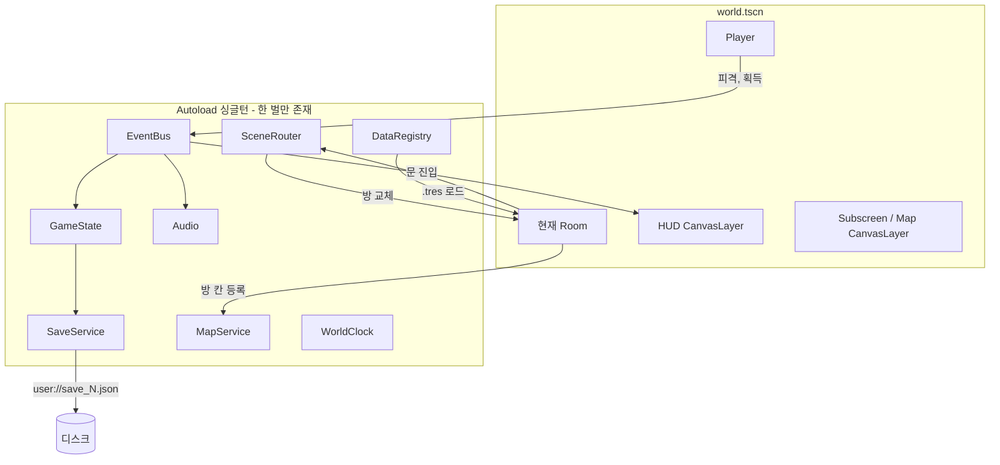

# Godot 전환 설계서 — 2D 메트로배니아 신작 (HD 리마스터)

작성: 2026-09-25 · 상태: **초안(승인 대기)** · 선행 문서: [ANALYSIS.md](ANALYSIS.md), [ASSET_POLICY.md](ASSET_POLICY.md)

## 0. 결정 사항

| 항목 | 결정 |
|---|---|
| 장르 | 2D 메트로배니아 신작 |
| 엔진 | Godot 4 최신 안정판(4.4 이상) |
| 언어 | GDScript, 정적 타입 힌트 필수 |
| 그래픽 | **HD 리마스터**: 에셋을 2배 업스케일 후 손보정, 내부 해상도 960×540, 1080p에서 2배 출력. 노멀맵 2D 동적 조명·그림자·글로우·파티클·다층 패럴랙스 |
| 에셋 | 원작자가 쓴 **오픈소스 에셋은 원래 배포처에서 라이선스를 확인한 뒤** 받아서 업스케일. 출처 불명·Konami 유래·ND 라이선스는 제외하고 신규 제작 |
| 배포 | 무료 배포 (NC 라이선스 에셋 사용 가능, 표기 의무 준수) |
| 저장소 | 새 GitHub 저장소 (이름·공개 여부 미정) |

## 1. 설계 원칙: CTLC2 부채를 Godot 기능으로 없애기

| CTLC2 부채 | Godot에서의 해법 |
|---|---|
| D1 코어 로직 28벌 복제 | 공통 시스템은 **Autoload 싱글턴** 한 벌. 플레이어는 씬 하나를 모든 방이 인스턴스로 씀 |
| D2 INI 전역 상태 | 메모리의 `GameState` 싱글턴이 유일한 원본. 파일은 저장할 때만 씀 |
| D3 슬롯별 코드 복제 | `SaveService.save(slot)` / `load(slot)` 한 벌, 슬롯은 매개변수 |
| D4 매직 넘버 키 | 이름 있는 필드 + 스키마 버전 + 마이그레이션 함수 |
| D5 데이터 하드코딩 | `Resource`(.tres) 기반 데이터: 아이템·장비·적·스킬·전리품 표 |
| D6 적 AI 공통 부품 없음 | `Enemy` 기반 씬 + 조합형 컴포넌트(Health, Hitbox, Hurtbox, Behavior) |
| D7 언어별 텍스트 오브젝트 | `TranslationServer` + CSV(ko, en) |
| D8 실행 순서 의존 | 상태기계 + 시그널. 순서가 필요한 곳은 `process_priority`로 명시 |
| D9 배경 개별 배치 2,795개 | `TileMapLayer` + TileSet 지형 자동 연결, 장식은 씬 |
| D10 150 MB 사운드 | OGG Vorbis, 음악 스트리밍, 효과음 풀링 |

## 2. CTLC2 → Godot 대응표

| CTLC2 | Godot 신작 |
|---|---|
| 프레임 47개 | 씬: `boot`, `title`, `save_select`, `world`, `game_over`, `ending` |
| 지역 = 프레임 (6400×5760px 등) | **방(Room) 씬** 여러 개를 `world`가 로드/언로드 |
| SUBSCREEN / MAP 프레임 이동 | `world` 위의 **CanvasLayer 오버레이** (씬 전환이 없어 상태 전달이 필요 없음) |
| `general/scrollind` (지역당 201줄) | 방마다 `Camera2D.limit_*` 자동 설정 |
| Platform Movement Object | `CharacterBody2D` + 플레이어 상태기계 (코요테 타임, 점프 버퍼, 가변 점프) |
| `delacement principal` / `heros collidor` | 플레이어 충돌체 + `Hurtbox`(Area2D) |
| `impacts inst creator` | `Hitbox`(Area2D) + `DamageInfo`, 애니메이션 프레임에서 켜고 끔 |
| `calcul attac / perte de vie / DEF / bad status` | `CombatMath`(순수 함수) + `StatusEffect` 리소스 |
| 적 1종 = 이벤트 그룹 1개 | `EnemyData`(.tres) + `enemy.tscn` + Behavior 노드 조합 |
| `E-x tir / debris / os` | `EnemyData.projectile_scene`, `death_effect_scene` |
| 보스 그룹(100~130줄) | Enemy + 페이즈 상태기계(`BossPhase` 리소스 목록) |
| Qualifiers system | Godot 그룹(`enemies`, `breakables`, `hazards`) |
| `swords` / `armes secondaires` / `FURIES` | `WeaponData` / `SubweaponData` / `SkillData` |
| `candeloro et mur destroyable` | `Breakable` 컴포넌트 + `LootTable` 리소스 |
| 아이템 409줄, 장비 5종×100줄, 도감 642줄 | `ItemData` / `EquipmentData` 목록을 UI가 순회해 자동 생성, `Bestiary`는 처치한 id 집합 |
| MAP + 탐험률 계산기 | `MapService`: 방이 차지하는 칸 좌표, 탐험한 칸 집합으로 % 계산 |
| `CONTROL CENTRAL SYSTEM` | `InputMap` 액션 + 키 재설정 UI |
| `SOUND calculator` | `Audio` 싱글턴 (버스: Master/Music/SFX/Voice) |
| `TEMPS/JOUR NUIT` | `WorldClock` 싱글턴 + `CanvasModulate` |
| 텍스트 7언어 오브젝트 | `tr()` + `i18n/strings.csv` |
| 7레이어 패럴랙스 (0/0.2/0.5/0.75/1) | `Parallax2D` 4장 + 게임플레이 레이어 |
| `SAVE POINTS` / `TELEPORT POINTS` 프레임 | `SavePoint`, `WarpPoint` 씬을 방 안에 배치 |
| `DualGlow.fx` | WorldEnvironment 글로우 + 캔버스 셰이더 |

## 3. 런타임 구조



| Autoload | 책임 | CTLC2 원형 |
|---|---|---|
| `GameState` | 능력치, 인벤토리, 장비, 플래그, 탐험 칸, 처치 기록 | INI + `A.Var*` 오브젝트 |
| `SaveService` | 슬롯 저장/로드, 스키마 버전, 임시 파일에 쓴 뒤 교체 | LOADING 프레임 |
| `EventBus` | 전역 시그널 (`damaged`, `item_picked`, `room_entered`, `boss_defeated`) | 오브젝트 간 값 전달 |
| `Audio` | 효과음 풀, 음악 크로스페이드, 볼륨 | SOUND calculator |
| `SceneRouter` | 방 전환(페이드, 스폰 지점), 씬 전환 | 프레임 이동 |
| `MapService` | 방 칸 좌표, 탐험률 | MAP 프레임 |
| `WorldClock` | 게임 내 시간, 낮밤 | TEMPS/JOUR NUIT |
| `DataRegistry` | id로 리소스 조회 | — |

충돌 레이어: 1 world · 2 one_way · 3 player · 4 enemy · 5 player_hitbox · 6 enemy_hitbox · 7 pickup · 8 interact

## 4. 프로젝트 폴더

```
project.godot
autoload/      game_state, save_service, event_bus, audio, scene_router, map_service, world_clock, data_registry
core/          combat_math, damage_info, state_machine, state
components/    health, hitbox, hurtbox, breakable, loot_dropper
actors/        player/(states/), enemies/(behaviors/), bosses/(phases/)
data/          items/ equipment/ enemies/ skills/ loot/ (*.tres), schema/(*.gd)
world/         world.tscn, rooms/<region>/room_NN.tscn, props/(save_point, warp_point, door)
ui/            hud/ subscreen/ map/ title/ dialog/
fx/            shaders/ particles/ post/
art/
  third_party/<pack>/   원본(라이선스 확인분) + LICENSE + 업스케일본
  original/             신규 제작
audio/         music/ sfx/
i18n/          strings.csv
tests/unit/    gdUnit4 또는 GUT
CREDITS.md     에셋별 작가·라이선스·원본 URL·수정 여부
```

## 5. 그래픽 개선 설계 (HD 리마스터)

| 영역 | 설계 |
|---|---|
| 해상도 | 내부 960×540, 1920×1080에서 정수배 ×2 출력. `stretch/mode = viewport`, 정수 배율 |
| 업스케일 | 원본 픽셀아트 → 2배 업스케일(픽셀아트 전용 스케일러 xBRZ 계열 또는 AI 업스케일) → **손보정**(윤곽·안티에일리어싱·색 정리) |
| 픽셀 정합 | 텍스처 필터 Nearest(업스케일본이 계단이 적으면 Linear도 비교), 2D 픽셀 스냅 |
| 타일 | 원본 16px 타일 → 32px. TileSet 지형 자동 연결 |
| 동적 조명 | `CanvasTexture`(diffuse + normal + specular), `PointLight2D`(횃불·마법·투사체), `DirectionalLight2D`(달빛), `LightOccluder2D` 그림자 |
| 노멀맵 | 업스케일본에서 Laigter 등으로 생성 후 손보정 |
| 분위기 | `CanvasModulate`로 방·시간대 색조 |
| 글로우 | WorldEnvironment 2D 글로우. 마법·불꽃·보스 공격에만 발광색 사용 |
| 특수효과 | 라이선스 확인된 이펙트는 업스케일 후 `AnimatedSprite2D`로 쓰고, 불꽃·연기·마법진·번개는 **셰이더/`GPUParticles2D`로 재구현**(해상도 무관, 더 선명) |
| 셰이더 | 피격 번쩍임, 사망 디졸브, 상태이상 팔레트 교체, 물 반사, 열기 아지랑이 |
| 타격감 | 히트스톱, 화면 흔들림, 넉백, 데미지 숫자 팝업 |
| 패럴랙스 | `Parallax2D` 4장(0 / 0.2 / 0.5 / 0.75) + 원경 안개층 |
| 렌더러 | 데스크톱 Forward+. 웹 데모는 Compatibility로 따로 검증 |

## 6. 테스트·품질

- 순수 로직은 `RefCounted` 클래스로 분리: `CombatMath`, 세이브 직렬화, `MapService` 탐험률, `Inventory`, `LootTable`
- 테스트: gdUnit4 또는 GUT (G0에서 결정), 헤드리스 실행으로 CI
- 대상 로직 커버리지 목표 85%. Godot 커버리지 측정 방법은 G0에서 검증
- 세이브 왕복 테스트 + 구버전 마이그레이션 테스트 필수
- **라이선스 게이트**: `CREDITS.md`에 없는 파일이 `art/`, `audio/`에 들어오면 CI 실패

## 7. 마일스톤

| 단계 | 내용 | 완료 기준 |
|---|---|---|
| A0 에셋 출처 조사 | 크레딧 목록 + 로컬 추출본 대조, 팩 단위 라이선스 확정 | 조사표에서 사용 가능/불가/신규 제작이 모두 분류됨 |
| G0 골격 | 프로젝트, Autoload 8개 틀, InputMap, 충돌 레이어, 테스트, CI, 라이선스 게이트 | 헤드리스 테스트 통과 |
| G1 조작감 | 플레이어 상태기계, 테스트 방 1개, **업스케일+노멀맵 조명 시험 장면** | 60fps, 원본 대비 전후 캡처 |
| G2 전투 | Hitbox/Hurtbox, `CombatMath`, 적 3종(데이터+행동 조합), 히트스톱 | 적 추가가 데이터만으로 가능 |
| G3 월드 | 방 3~5개, 문 전환, 카메라 경계, 세이브 슬롯 3개, 지도 | 저장/로드 왕복 테스트 |
| G4 성장 | 아이템·장비·보조무기·스킬, 서브스크린, 전리품, 도감 | 아이템 추가 = .tres 하나 |
| G5 보스 | 보스 1체, 페이즈 상태기계 | 페이즈 전환 테스트 |
| G6 아트·연출 | 업스케일 에셋 일괄 보정, 이펙트 재구현 | 전후 비교 캡처 |
| G7 확장 | 지역·적·보스 추가, 현지화(ko/en) | 콘텐츠 추가에 코드 수정이 거의 없음 |

## 8. 남은 질문

- 새 저장소 이름과 공개/비공개 여부
- 게임 제목·세계관·주인공 (Castlevania 명칭·캐릭터는 쓸 수 없음)
- 원작자 크레딧 목록 (A0 입력)
- 이 PC에 Godot 미설치 → G0 전에 설치 필요
